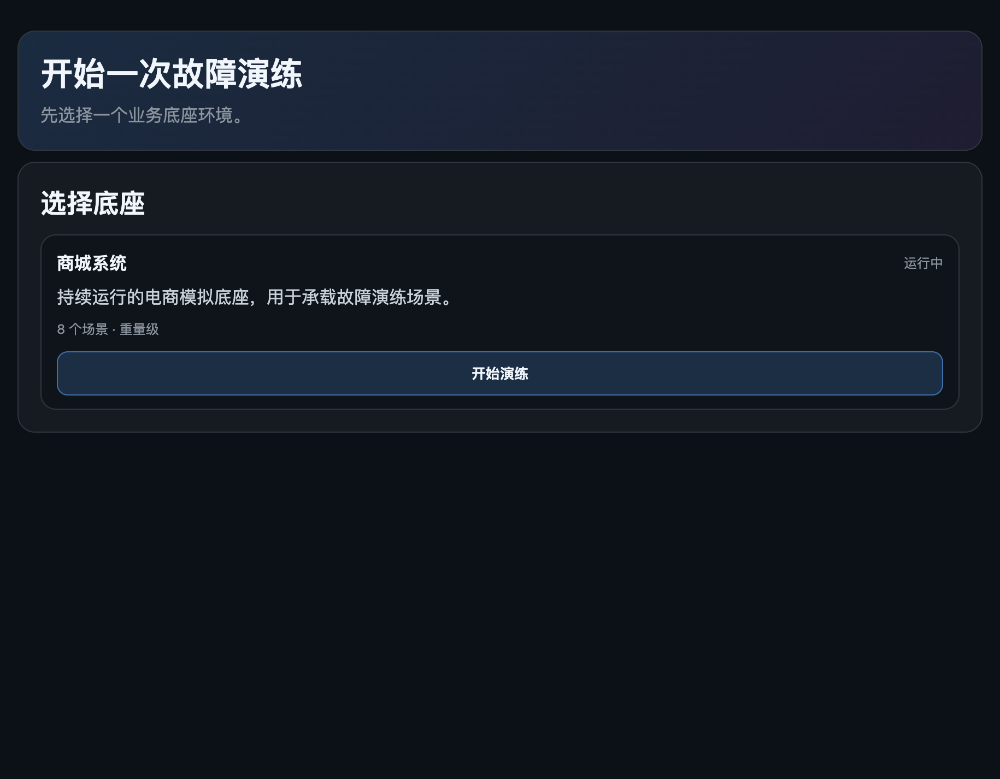
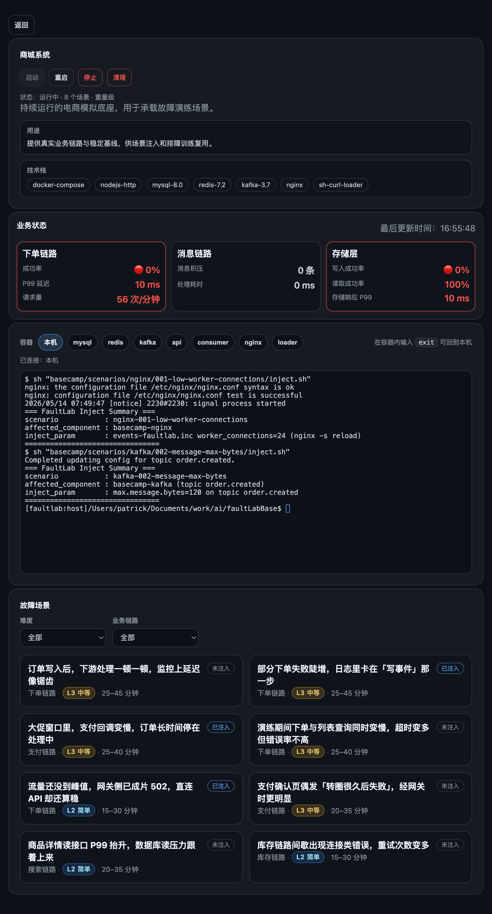
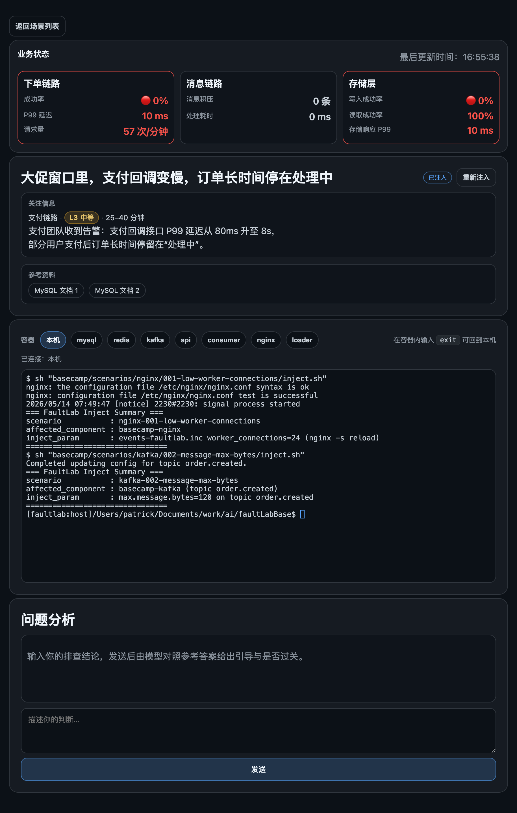

# FaultLab

**本地优先的故障排查演练平台** — 在真实容器环境中注入线上级别的故障，用 AI 引导你完成「现象 → 证据 → 根因 → 方案」的完整排障过程。

> 很多工程师在真实故障面前手足无措，不是因为技术不够，而是从来没有机会在压力下系统地练过。FaultLab 提供贴近真实线上的场景，不是做题，是真的要自己看监控、进容器、查日志、找根因。

---

## 界面预览







---

## 功能特点

- **真实业务底座**：完整电商系统（MySQL + Redis + Kafka + Nginx），持续产生下单、支付、消息等真实流量，提供可观测的基线指标
- **场景化故障注入**：8 个还原自真实线上问题的故障场景，按业务链路与难度分级，一键注入 / 重置
- **实时监控面板**：注入前后各链路成功率、P99 延迟、请求量实时对比，故障现象一目了然
- **AI 引导验证**：提交排查结论后，LLM 对照参考答案给出针对性引导，而非直接告诉你答案——强化排障思维，不是帮你通关
- **双入口**：Web 面板（推荐）或 CLI，支持直接 exec 进入 mysql / redis / kafka / nginx 等容器现场排查
- **多模型支持**：默认 Qwen，可通过 `.env` 切换为任意 OpenAI 兼容接口（OpenAI、Claude 等）

---

## 故障场景库

> 底座：**商城系统**（电商模拟环境，持续运行，重量级）

| 场景描述 | 业务链路 | 难度 | 预计时长 |
|----------|----------|------|----------|
| 订单写入后，下游处理一顿一顿，监控上延迟像锯齿 | 下单链路 | L3 中等 | 25–45 min |
| 部分下单失败陡增，日志里卡在「写事件」那一步 | 下单链路 | L3 中等 | 25–45 min |
| 大促窗口里，支付回调变慢，订单长时间停在处理中 | 支付链路 | L3 中等 | 25–40 min |
| 演练期间下单与列表查询同时变慢，超时变多但错误率不高 | 下单链路 | L3 中等 | 25–40 min |
| 流量还没到峰值，网关侧已成片 502，直连 API 却还算稳 | 下单链路 | L2 简单 | 15–30 min |
| 支付确认页偶发「转圈很久后失败」，经网关时更明显 | 支付链路 | L3 中等 | 20–35 min |
| 商品详情读接口 P99 抬升，数据库读压力跟着上来 | 搜索链路 | L2 简单 | 20–35 min |
| 库存链路间歇出现连接类错误，重试次数变多 | 库存链路 | L2 简单 | 15–30 min |

---

## 快速开始

### 环境要求

- Docker >= 24（需支持 `docker compose` 子命令）
- Node.js（仅 Web 面板需要）
- 建议可用内存 >= 4 GB（商城底座含 MySQL + Redis + Kafka + Nginx）

### 启动 Web 面板（推荐）

```bash
# 1. 克隆仓库
git clone https://github.com/zwell/faultLabBase.git
cd faultLabBase

# 2. 配置 LLM（用于 AI 引导验证）
cp .env.example .env
# 编辑 .env，填入你的 API Key

# 3. 启动 Web 面板
cd webapp && npm install && npm start

# 浏览器访问 http://localhost:4173
# 在 Web 内选择底座 → 启动 → 选择场景 → 注入故障 → 开始排查
```

### CLI 方式

```bash
# 设置场景
export FAULTLAB_PROJECT=basecamp
export FAULTLAB_SCENARIO=basecamp/scenarios/nginx/001-low-worker-connections

# 启动环境
./cli/faultlab.sh start

# 注入故障
./cli/faultlab.sh inject

# 提交你的分析结论（AI 引导验证）
./cli/faultlab.sh verify

# 清理环境
./cli/faultlab.sh clean
```

详细命令说明见 [`docs/CLI_USAGE.md`](docs/CLI_USAGE.md)

---

## 演练流程

```
选择底座  →  启动环境  →  查看基线指标
    ↓
注入故障  →  观察现象（监控 / 日志 / 容器内排查）
    ↓
提交根因分析  →  AI 引导反馈（对照参考答案）
    ↓
清理环境  →  复盘总结
```

---

## 项目结构

```
faultLabBase/
├── basecamp/               # 商城系统底座
│   ├── docker-compose.yml
│   └── scenarios/          # 故障场景
│       ├── kafka/
│       ├── mysql/
│       ├── nginx/
│       └── redis/
├── cli/
│   └── faultlab.sh         # 统一 CLI 入口
├── webapp/                 # Web 面板（Node.js）
├── docs/
│   ├── CLI_USAGE.md
│   ├── ADDING_SCENARIOS.md
│   └── CONTRIBUTING.md
└── .env.example
```

每个场景目录包含：`meta.yaml`（元信息）· `docker-compose.yml` · `inject.sh`（注入脚本）· `README.md`（场景背景）· `SOLUTION.md`（参考答案）· `test.sh`

---

## 新增场景

欢迎贡献新场景，详见 [`docs/ADDING_SCENARIOS.md`](docs/ADDING_SCENARIOS.md) 与 [`docs/CONTRIBUTING.md`](docs/CONTRIBUTING.md)。

场景需包含：可复现的注入逻辑、清晰的故障现象描述、完整的参考答案（SOLUTION.md）。

---

## Tech Stack

`Docker Compose` · `MySQL 8.0` · `Redis 7.2` · `Kafka 3.7` · `Nginx` · `Node.js` · `Shell` · `Qwen / OpenAI API`
